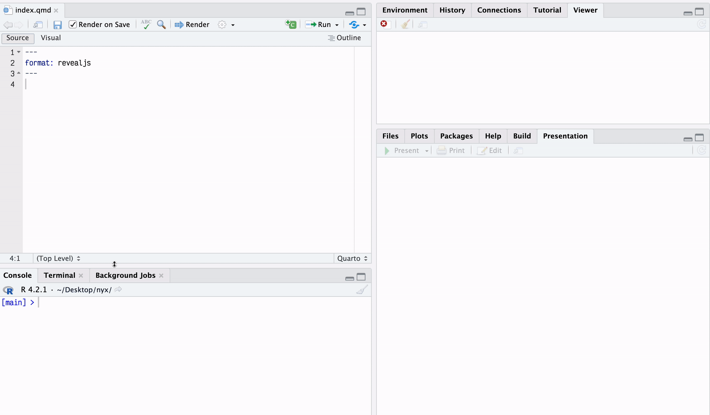

# nyx

<!-- badges: start -->
<!-- badges: end -->

The goal of nyx is to add a GUI slide template menu for use with quarto. It is specifically made with revealjs slides in mind, but could be used with anything really.

## Installation

You can install the development version of nyx like so:

``` r
pak::pak("emilhvitfeldt/nyx")
```

## Example



## Todo / Idea

- [ ] Would be great if the possible options could be read from the a local file, possibly from the theme/template that is used.
- [ ] Selection menu should ideally support SVGs/images, this way the user can see what they get
